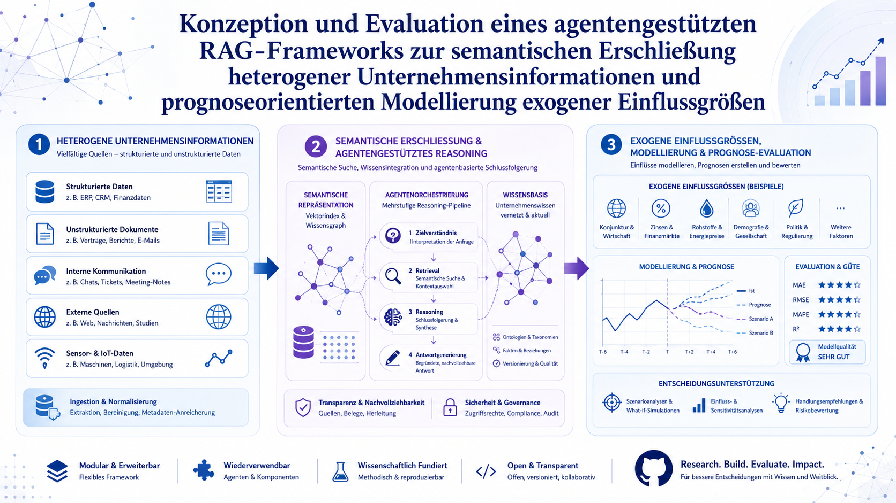

<p align="center">
  
</p>

# Agentengestütztes RAG-Framework

**Konzeption und Evaluation eines agentengestützten RAG-Frameworks zur semantischen Erschließung heterogener Unternehmensinformationen und prognoseorientierten Modellierung exogener Einflussgrößen**

Technisches Forschungsartefakt zur gleichnamigen Masterarbeit im Studiengang *Angewandte Künstliche Intelligenz*. Dieses Repository ist die technische Umsetzung der Masterarbeit und bildet bewusst deren Kapitel- und Forschungslogik ab. Es ist kein loser Experimentordner, sondern ein reproduzierbares, modular aufgebautes Forschungsartefakt.

---

## Inhaltsverzeichnis

- [Kurzbeschreibung](#kurzbeschreibung)
- [Forschungsziel](#forschungsziel)
- [Architekturüberblick](#architekturüberblick)
- [Forschungsfragen](#forschungsfragen)
- [Repository-Struktur](#repository-struktur)
- [Quickstart](#quickstart)
- [Datenhinweise](#datenhinweise)
- [Notebooks](#notebooks)
- [Evaluation](#evaluation)
- [Reproduzierbarkeit](#reproduzierbarkeit)
- [Roadmap](#roadmap)
- [Zitierhinweis](#zitierhinweis)
- [Lizenz und Nutzungsgrenzen](#lizenz-und-nutzungsgrenzen)

---

## Kurzbeschreibung

Das Framework verbindet Retrieval-Augmented Generation (RAG) mit einer agentengestützten Orchestrierung, um heterogene Unternehmensinformationen aus strukturierten und unstrukturierten Quellen semantisch zu erschließen. Aufbauend auf den so erschlossenen Wissensbeständen werden exogene Einflussgrößen prognoseorientiert modelliert und die Ergebnisse entlang klar definierter Metriken evaluiert.

## Forschungsziel

Ziel ist die Konzeption, prototypische Realisierung und Evaluation eines Frameworks, das (1) heterogene Quellen verlässlich und nachvollziehbar erschließt (Provenance), (2) agentengestütztes Reasoning für mehrstufige Analysefragen ermöglicht und (3) exogene Einflussgrößen prognoseorientiert modelliert. Der Fokus liegt auf Nachvollziehbarkeit, Reproduzierbarkeit und methodischer Sauberkeit – nicht auf der Produktion vermeintlich fertiger Ergebnisse.

## Architekturüberblick

Die Architektur ist in drei Wirkungsbereiche gegliedert, die der Coverabbildung entsprechen:

1. **Heterogene Unternehmensinformationen** – strukturierte Daten (z. B. ERP, CRM, Finanzdaten), unstrukturierte Dokumente, interne Kommunikation, externe Quellen sowie Sensor- und IoT-Daten werden über eine Ingestion- und Normalisierungsschicht aufgenommen.
2. **Semantische Erschließung und agentengestütztes Reasoning** – Chunking, Embedding und Vektorindex bilden die semantische Repräsentation; eine mehrstufige Agenten-Pipeline (Zielverständnis, Retrieval, Reasoning, Antwortgenerierung) arbeitet gegen eine vernetzte Wissensbasis mit Provenance und Governance.
3. **Exogene Einflussgrößen und Prognose-Evaluation** – ausgewählte exogene Faktoren werden modelliert, Prognosen erstellt und entlang von Güte- und Systemmetriken bewertet.

Eine ausführliche Beschreibung findet sich in den Dokumentationskapiteln unter `docs/`.

## Forschungsfragen

**Übergeordnete Forschungsfrage:** Wie kann ein agentengestütztes RAG-Framework gestaltet werden, das heterogene Unternehmensinformationen semantisch erschließt, Antworten quellengebunden erzeugt und interne Kennzahlen mit exogenen Einflussgrößen zu einer szenario- und prognoseorientierten Modellierung verbindet?

Sie wird in sechs eigenständig operationalisierbare Teilforschungsfragen ausdifferenziert (Herleitung und Operationalisierung in `docs/01_einleitung.md`):

- **FF1 – Semantische Ingestion:** Wie kann eine robuste Ingestion-Pipeline heterogene Unternehmensdokumente extrahieren, strukturell rekonstruieren, segmentieren, mit Metadaten anreichern und für semantisches Retrieval verfügbar machen?
- **FF2 – Chunking, Embedding und Retrieval:** Welche Kombination aus Chunking-Strategie, Embedding-Modell und Retrieval-Verfahren erzielt für den Unternehmenskorpus die beste Retrieval- und Kontextqualität?
- **FF3 – Vektordatenbank und Wissensorganisation:** Wie ist eine Vektordatenbank- und Wissensorganisationsschicht zu gestalten, die hybride Suche, Metadatenfilterung, Provenance, Source Trust und inkrementelle Aktualisierung trägt?
- **FF4 – Agentengestützte Analysearchitektur:** Wie können Agenten komplexe Analysefragen durch Query Planning, Tool-Nutzung, Multi-Hop-Retrieval, Validierung und Quellenbindung kontrolliert beantworten?
- **FF5 – Prognoseorientierte Modellierung:** Wie lassen sich extrahierte Unternehmenskennzahlen mit exogenen Einflussgrößen koppeln, um dynamische Szenario- und Prognosemodelle zu ermöglichen?
- **FF6 – Evaluation:** Wie lässt sich das Gesamtframework entlang technischer, fachlicher, prognosebezogener und vertrauensbezogener Qualitätsdimensionen evaluieren?

## Repository-Struktur

```text
rag-framework/
├── README.md
├── LICENSE
├── CITATION.cff
├── pyproject.toml
├── requirements.txt
├── docker-compose.yml
├── .env.example
├── .gitignore
│
├── assets/
│   ├── images/            # Coverbild und Abbildungen
│   └── diagrams/          # Architektur- und Ablaufdiagramme
│
├── docs/                  # Dokumentation entlang der Kapitellogik (00–12)
│   └── project_workpackages/   # Arbeitspakete AP01–AP11
│
├── notebooks/             # Forschungs- und Experimentierumgebung (01–08)
│
├── src/
│   └── rag_framework/     # Produktiver Python-Code (Package)
│       ├── ingestion/     # Semantische Ingestion
│       ├── chunking/      # Chunking-Strategien
│       ├── embeddings/    # Embedding-Modelle
│       ├── retrieval/     # Retrieval-Logik
│       ├── vectorstore/   # Vektordatenbank-Anbindung
│       ├── knowledge/     # Wissensorganisation, Provenance, Source Trust
│       ├── agents/        # Agentengestützte Architektur
│       ├── forecasting/   # Prognosemodellierung exogener Faktoren
│       ├── evaluation/    # Evaluationsmetriken
│       ├── api/           # API-Schicht
│       └── utils/         # Hilfsfunktionen
│
├── configs/               # YAML-Konfigurationen pro Komponente
├── data/                  # Datenhinweise, Beispiel- und Goldstandard-Daten
├── tests/                 # pytest-basierte Tests
├── frontend/              # Frontend (bestehend)
├── chunking-viz/          # Interaktive Chunking-Visualisierung (bestehend)
├── landing-page/          # Dokumentations-/Landing-Page (optional)
└── .github/               # Workflows, Issue- und PR-Templates
```

> Hinweis: `src/`, `docs/`, `configs/`, `tests/` und Teile der `.github/`-Struktur werden im Zuge der Neustrukturierung schrittweise aufgebaut. Der bisherige Stand ist im Branch `backup/pre-restructure` gesichert.

## Quickstart

```bash
# 1. Repository klonen
git clone https://github.com/DYsop/rag-framework.git
cd rag-framework

# 2. Python-Umgebung einrichten
python -m venv .venv
source .venv/bin/activate        # Windows: .venv\Scripts\activate
pip install -r requirements.txt

# 3. Konfiguration vorbereiten
cp .env.example .env             # Werte lokal eintragen, .env wird NICHT versioniert

# 4. Infrastruktur (Vektor-DB etc.) optional via Docker starten
docker-compose up -d

# 5. Tests ausführen
pytest tests/
```

Die interaktive Chunking-Visualisierung kann separat gestartet werden:

```bash
cd chunking-viz
npm install
npm run dev
```

## Datenhinweise

Es werden **keine** echten, vertraulichen oder urheberrechtlich problematischen Rohdaten in das Repository aufgenommen. Versioniert werden ausschließlich kleine Beispieldaten, synthetische Testdaten und Goldstandard-Fragen. Details, Ordnerstruktur und die Trennung von Roh-, verarbeiteten und Goldstandard-Daten sind in [`data/README.md`](data/README.md) beschrieben.

Wichtige Architekturentscheidung: Die eigentliche Verarbeitung großer oder geschützter Dokumente läuft **nicht** auf GitHub, sondern lokal, auf einem NAS, in Docker, in JupyterLab oder in Codespaces. GitHub enthält Code, Konfiguration, Dokumentation, kleine Testdaten und reproduzierbare Notebooks.

## Notebooks

Die Notebooks unter `notebooks/` dienen als Forschungs- und Experimentierumgebung. Produktiver Code liegt in `src/rag_framework/` und wird von den Notebooks importiert. Jedes Notebook beginnt mit einer Markdown-Zelle, die Ziel und Bezug zur Masterarbeit beschreibt:

| Notebook | Ziel |
|----------|------|
| `01_data_discovery.ipynb` | Sichtung und Charakterisierung der Datenbasis |
| `02_document_extraction.ipynb` | Extraktion und Normalisierung heterogener Dokumente |
| `03_chunking_experiments.ipynb` | Vergleich von Chunking-Strategien |
| `04_embeddings_retrieval.ipynb` | Embedding- und Retrieval-Experimente |
| `05_vector_database.ipynb` | Aufbau und Test der Vektordatenbank |
| `06_agentic_rag.ipynb` | Agentengestützte Retrieval- und Analysearchitektur |
| `07_forecasting_exogenous_factors.ipynb` | Prognosemodellierung exogener Einflussgrößen |
| `08_evaluation.ipynb` | Gesamtevaluation entlang aller Metriken |

## Evaluation

Die Evaluation deckt mehrere Dimensionen ab: Ingestion-Qualität, Chunking-Qualität, Retrieval-Metriken (Recall@k, Precision@k, MRR, nDCG), Antwortqualität (Faithfulness, Answer Relevancy, Context Recall), Provenance und Zitierfähigkeit, Agentenmetriken (Tool-Erfolg, Planungsgüte, Quellenbindung), Prognosemetriken (MAE, RMSE, MAPE, Directional Accuracy) sowie Systemmetriken (Latenz, Kosten, Robustheit, Reproduzierbarkeit). Konzept und Vorgehen sind in [`docs/11_evaluation.md`](docs/11_evaluation.md) dokumentiert.

## Reproduzierbarkeit

Reproduzierbarkeit wird durch deklarative Konfiguration (`configs/*.yaml`), feste Abhängigkeiten (`requirements.txt`, `pyproject.toml`), eine klare Trennung von Experiment und Produktivcode sowie durch CI-Workflows (`.github/workflows/`) unterstützt. Es werden keine Scheinergebnisse erzeugt; nicht implementierte Funktionen sind als `TODO` mit Docstrings gekennzeichnet.

## Roadmap

Der Arbeitsfortschritt ist in Arbeitspaketen (AP01–AP11) unter `docs/project_workpackages/` und in den GitHub Issues/Projects organisiert. Die Pakete bilden die Kapitellogik der Masterarbeit ab – von der Repository-Neustrukturierung über Datenbasis, Ingestion, Vektordatenbank, Agentenarchitektur und Prognosemodellierung bis zu Evaluation und Release.

## Zitierhinweis

Wenn dieses Artefakt zitiert wird, bitte die Angaben aus [`CITATION.cff`](CITATION.cff) verwenden.

## Lizenz und Nutzungsgrenzen

Die Lizenz ist in [`LICENSE`](LICENSE) hinterlegt. Das Repository enthält bewusst keine echten Unternehmensdaten, keine großen Rohdaten und keine vertraulichen Inhalte. Es dient als technische und dokumentarische Grundlage zur Masterarbeit.
